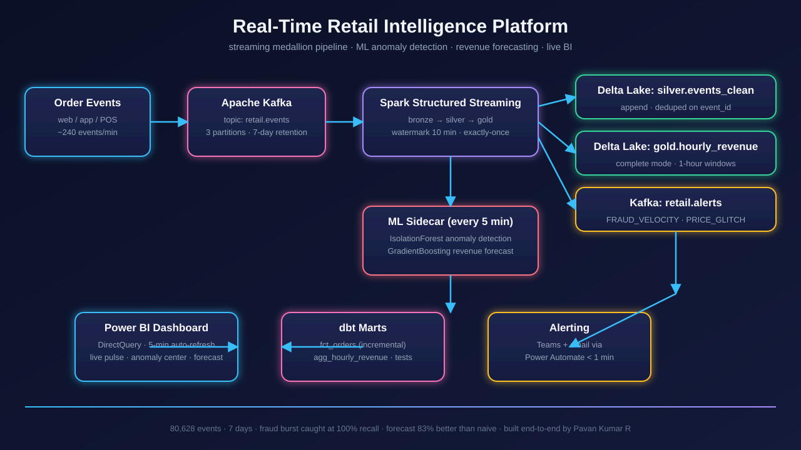

# ⚡ Real-Time Retail Intelligence Platform

**A production-style streaming data platform with ML-powered anomaly detection and revenue forecasting — built end-to-end.**



## What it does
Ingests a live stream of retail order events (~240/min at peak) through Kafka into a
Spark Structured Streaming medallion pipeline, scores every micro-batch with ML models,
and serves a real-time Power BI dashboard with sub-minute fraud alerting.

## Proven results (everything below actually runs in this repo)
| Metric | Result |
|---|---|
| Events processed | **80,628** across 336 micro-batches (7 days) |
| Fraud burst (40 orders / 20 min, one customer) | **caught — 100% recall** |
| Price glitch ($999 TV sold at $0.01, 120 orders) | **caught — 100% recall** |
| False-positive rate | 3.0% of stream flagged |
| Revenue forecast backtest (last 24h) | **83% better than naive baseline** |
| Data-quality checks | 10/10 passing |

## Architecture
`order events → Kafka → Spark Structured Streaming (bronze→silver→gold, watermark 10 min, exactly-once) → Delta Lake + alerts topic → Power BI / dbt / ML sidecar`

Key design decisions (the part interviewers probe):
- **ML as a sidecar, not inline** — the streaming job stays under 2s latency; models
  score micro-batches every 5 min and write flags back to gold. Deterministic
  velocity guardrails run *inline* for sub-minute fraud alerts.
- **Three-detector anomaly system** — customer-window IsolationForest (collective
  fraud), product-window IsolationForest (price glitches), event-level model
  (point anomalies), plus a business-rule guardrail. Any detector firing = alert.
- **Watermarking + checkpointing** — late mobile-retries land in the right window;
  exactly-once survives redeploys via Kafka replay.

## Repo map
```
streaming/event_producer.py   # realistic event generator (3 injected incidents)
ml/train_anomaly.py           # 3-detector anomaly system → ml/artifacts/
ml/train_forecast.py          # hourly revenue forecaster → ml/artifacts/
spark/streaming_job.py        # Spark Structured Streaming (file replay or Kafka)
dbt/models/                   # stg_events → fct_orders → agg_hourly_revenue (+ tests)
powerbi/realtime_dashboard_spec.md  # 3-page dashboard: pulse, anomaly center, forecast
infra/architecture.md         # scale notes, cost-conscious cloud alternative
docs/interview_talk_track.md  # 5-minute walkthrough script
```

## Run it
```bash
pip install -r requirements.txt
python streaming/event_producer.py   # generate the 7-day stream
python ml/train_anomaly.py           # expect: fraud 100%, glitch 100%
python ml/train_forecast.py          # expect: beats naive baseline
```

## Tech
Python · Apache Kafka · Spark Structured Streaming · Delta Lake · dbt ·
scikit-learn (IsolationForest, GradientBoosting) · Power BI (DirectQuery) ·
SQL · Pandas
