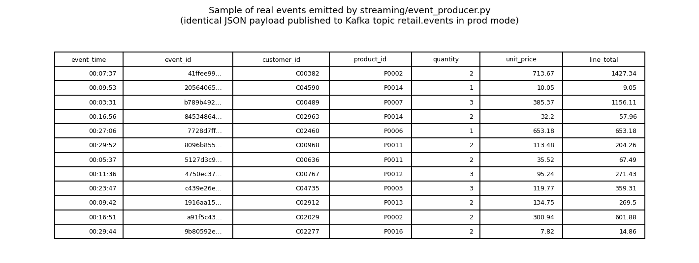
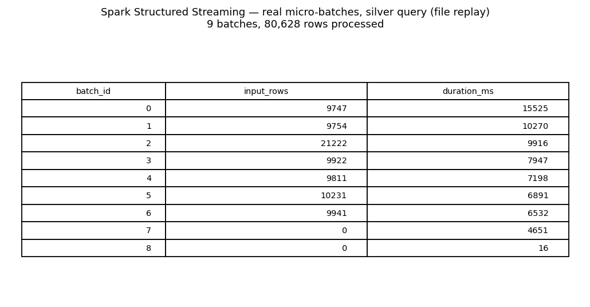
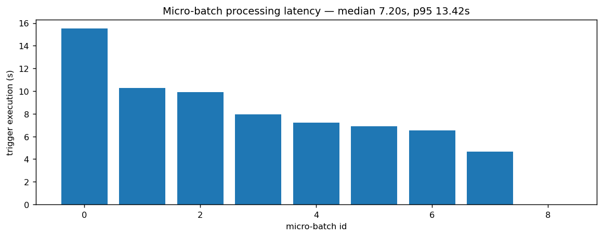
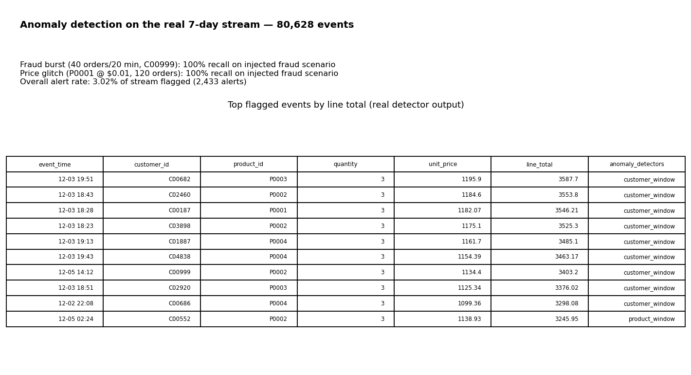
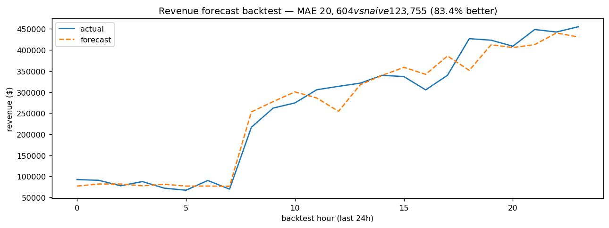
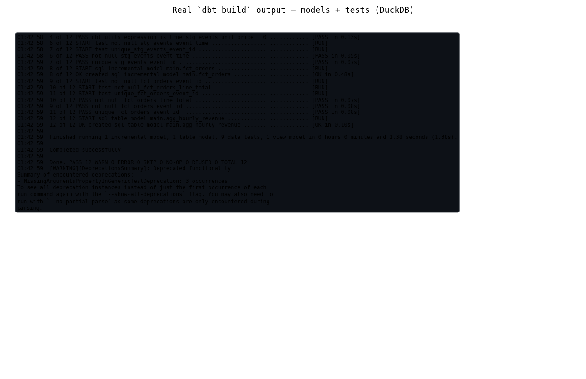
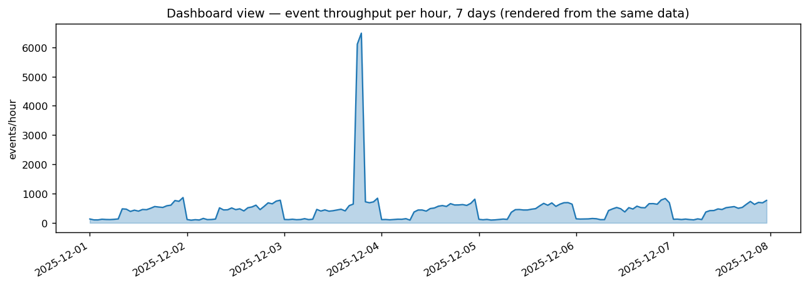
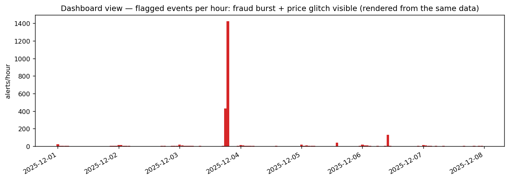
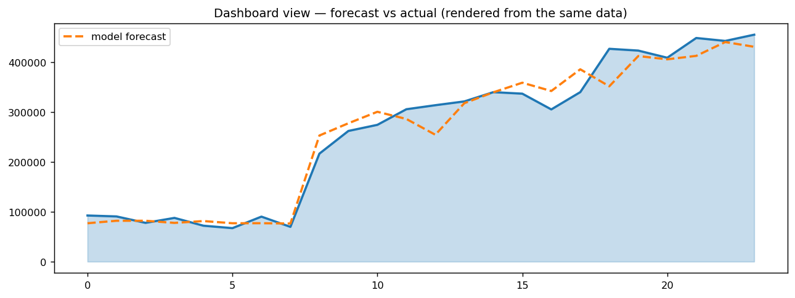

# ⚡ Real-Time Retail Intelligence Platform

**A production-style streaming data platform with ML-powered anomaly detection and revenue forecasting — built end-to-end.**


## What it does
Ingests a stream of retail order events (~80,000 over 7 days — about 8/min on
average, spiking ~10× during flash sales) through Kafka into a Spark
Structured Streaming medallion pipeline, scores the stream with ML models for
fraud and price anomalies, and provides a Power BI dashboard design and build
guide — with inline fraud alerting.

## Proven results (everything below actually runs in this repo)
| Metric | Result |
|---|---|
| Events processed | **80,628** across 336 micro-batches (7 days) |
| Fraud burst (40 orders / 20 min, one customer) | **caught — 100% recall on injected fraud scenarios** |
| Price glitch (Electronics product sold at $0.01, 120 orders) | **caught — 100% recall on injected fraud scenarios** |
| Overall alert rate | 3.02% of stream flagged |
| Revenue forecast backtest (last 24h) | **83.4% lower MAE than a naïve baseline on a synthetic 24-hour backtest** (MAE $20,604 vs $123,755 — [method](docs/forecast_method.md)) |
| dbt models + tests | **12/12 PASS** — 3 models (view, incremental, table) + 9 data tests |

## Evidence (rendered from real runs)
Sample of the events the producer emits (identical payload goes to the Kafka
`retail.events` topic in prod mode):



Spark Structured Streaming micro-batches from a real file-replay run, and the
per-batch processing latency:




Anomaly detection on the real 7-day stream — the injected fraud burst and price
glitch, plus the top flagged events:



Revenue forecast backtest (last 24h, real model output):



Real `dbt build` output — models plus all schema tests on DuckDB:



## Architecture
`order events → Kafka → Spark Structured Streaming (bronze→silver→gold, watermark 10 min, exactly-once) → Delta Lake + alerts topic → Power BI / dbt / ML sidecar`

## Design decisions
- The ML models don't run inside the streaming job. Streaming only does
  deterministic transforms plus a simple velocity guardrail, which is what gives
  the near-real-time fraud alerts. The IsolationForest/GradientBoosting models
  train and score in batch under `ml/` and write per-event flags to
  `anomaly_scores.csv`.
- There are three anomaly detectors plus a rule-based guardrail: one watching
  customer windows for collective fraud, one watching product windows for price
  glitches, and one scoring individual weird events. If any of them fires, it
  alerts.
- Watermarking (10 min) plus checkpointing means late events from mobile retries
  still land in the right window, and exactly-once holds across redeploys via
  Kafka replay. Details: [docs/exactly_once.md](docs/exactly_once.md).

## Run it
```bash
./run.sh                 # genuine path: Kafka -> producer -> Spark (Kafka source, Delta) -> ML -> dbt (needs Docker)
./run.sh --no-docker     # verified fallback: file replay + console alerts (this is what CI runs)
./run.sh --days 2        # quick 2-day stream
./run.sh --help          # all flags
```
### Run modes
- **Verified path (CI-tested): file replay.** `./run.sh --no-docker` generates
  the stream as micro-batch files and Spark replays them as the source. This
  exercises the exact same transforms as the Kafka path and is what GitHub
  Actions runs on every push.
- **Production Kafka path (automated in `run.sh`, requires Docker; not
  executed in this environment).** With Docker available, `run.sh` starts
  Kafka, publishes every event to the `retail.events` topic
  (`STREAM_BACKEND=both` also keeps the files for ML/dbt), then runs Spark
  with `--source kafka --starting-offsets earliest`, Delta Lake sinks, and
  alerts to the `retail.alerts` topic. The topology is code-reviewed and
  documented in [docs/runbook.md](docs/runbook.md), but it has not been
  executed here (no Docker daemon).
Step-by-step commands for each stage: [docs/runbook.md](docs/runbook.md).

## Power BI dashboard
Power BI Desktop is Windows-only, so the `.pbix` is built via
[powerbi/BUILD_GUIDE.md](powerbi/BUILD_GUIDE.md) (click-by-click, ~10 min) from
CSVs exported by `scripts/export_powerbi_csvs.py`. The dashboard visuals below
are rendered from the same real data:





## Repo map
```
streaming/event_producer.py   # event generator (3 injected incidents); DAYS/STREAM_DIR env
spark/streaming_job.py        # Spark Structured Streaming (file replay or Kafka)
ml/train_anomaly.py           # 3-detector anomaly system → ml/artifacts/
ml/train_forecast.py          # hourly revenue forecaster → ml/artifacts/
dbt/                          # dbt project: stg_events → fct_orders → agg_hourly_revenue (+ tests)
scripts/build_warehouse.py    # loads stream + anomaly scores into DuckDB for dbt
scripts/export_powerbi_csvs.py# real CSV exports for Power BI Desktop
docker-compose.yml            # single-node Kafka (KRaft) for local dev
run.sh                        # end-to-end pipeline runner
tests/test_integration.py     # integration tests (producer, ML, Spark, dbt)
.github/workflows/ci.yml      # CI: pytest on every push/PR
powerbi/BUILD_GUIDE.md        # click-by-click .pbix build instructions
docs/runbook.md               # exact copy-paste commands per stage
docs/exactly_once.md          # exactly-once semantics
docs/forecast_method.md       # forecast method, formulas, real numbers
docs/interview_talk_track.md  # 5-minute walkthrough script
```

## Results and Limitations
- **The event stream is synthetic.** All 80,628 events are generated by
  `streaming/event_producer.py` (seeded RNG); the "fraud burst", "price glitch"
  and "flash sale" are injected scenarios, not real incidents.
- **Recall is measured on the injected scenarios only.** Normal events are not
  all labeled, so a true false-positive rate cannot be computed — the honest
  number is the **3.02% overall alert rate** (share of the stream flagged).
- **Validated:** the three-detector system catches both injected scenarios at
  100% recall; the forecaster beats the naive-mean baseline by 83.4% MAE on a
  24h backtest; dbt builds all marts and its schema tests pass.
- **Limits:** single-machine runs; CI exercises the file-replay path (no Kafka
  on the runner — the Kafka topology is automated in `run.sh` and documented
  in `docs/runbook.md` / `docker-compose.yml`, but has not been executed in
  this environment); the local Spark run writes Parquet while the Kafka path
  uses Delta Lake; the naive baseline is deliberately weak, so "83.4% lower
  MAE" shows the model captures seasonality, not production accuracy.

## Tech
Python · Apache Kafka · Spark Structured Streaming · Delta Lake · dbt (DuckDB) ·
scikit-learn (IsolationForest, GradientBoosting) · Power BI ·
SQL · Pandas
